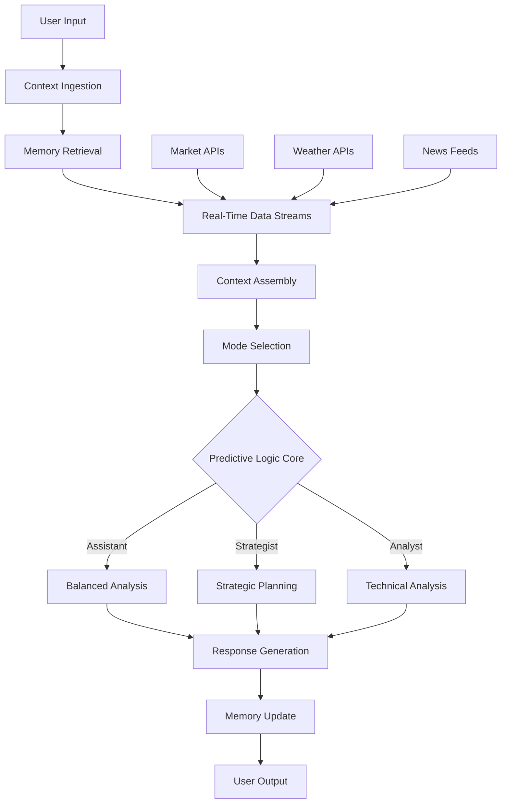

# ORAC - Operational Reality Architect & Command

<div align="center">

⚡ **Next-Generation Context Engineering Framework** ⚡

[](https://reactjs.org/)
[](https://tailwindcss.com/)
[](LICENSE)

*Moving beyond traditional prompt engineering and RAG to create persistent, decision-aware cognitive systems*

[🚀 Live Demo](https://axion-project.github.io/orac-prototype/) • [📖 Documentation](#documentation) • [🤝 Contributing](#contributing)

</div>

---

## 🎯 What is ORAC?

ORAC (Operational Reality Architect & Command) represents the evolution of AI systems from reactive engines to **proactive cognitive partners**. Unlike traditional chatbots or RAG systems, ORAC integrates:

- **🧠 Persistent Memory** - Builds knowledge over time, not just per session
- **📊 Real-Time Data Streams** - Live market, weather, news integration
- **🔮 Predictive Logic** - Forward-looking analysis and decision modeling  
- **🎭 Multi-Mode Reasoning** - Assistant, Strategist, and Analyst personas
- **🔄 Context Engineering** - Intelligent assembly of relevant information
- **🛠️ Tool Integration** - Seamless API and data source connectivity

## 🌟 Key Features

### Real-Time Intelligence
- **Live Market Data**: Stock prices, trends, volatility analysis
- **Weather Integration**: Current conditions for decision making
- **News Streams**: Breaking developments that affect context
- **Dynamic Updates**: Data refreshes every 8 seconds

### Multi-Mode AI Personas
| Mode | Focus | Example Output |
|------|-------|----------------|
| 🤖 **Assistant** | Balanced guidance | "Apple is at $187.45 (+2.30). Given volatility of 1.2x, moderate positioning recommended." |
| 🎯 **Strategist** | Long-term planning | "Strategic outlook: Positive momentum suggests accumulation strategy. Consider 60% allocation based on current trends." |
| 📊 **Analyst** | Technical analysis | "AAPL: $187.45 \| Change: +2.30 \| Momentum: BULLISH \| Volatility: NORMAL \| Risk: MODERATE" |

### Intelligent Memory System
- **Contextual Storage**: Remembers conversations, decisions, preferences
- **Relevance Scoring**: Surfaces most pertinent historical information
- **Cross-Session Learning**: Builds understanding over multiple interactions

### Stock Market Intelligence
Supports detailed analysis of major stocks:
- **Apple (AAPL)** - Real-time price tracking and analysis
- **Tesla (TSLA)** - Momentum and volatility assessment  
- **Microsoft (MSFT)** - Strategic positioning insights
- **Google (GOOGL)** - Technical indicators and trends
- **NVIDIA (NVDA)** - Market correlation analysis

## 🚀 Quick Start

### Prerequisites
- **Node.js** 16.0.0 or higher
- **npm** 8.0.0 or higher

### Installation

```bash
# Clone the repository
git clone https://github.com/yourusername/orac-prototype.git
cd orac-prototype

# Install dependencies
npm install

# Start development server
npm start

# Open your browser to http://localhost:3000
```

### Build for Production
```bash
# Create optimized build
npm run build

# Deploy to GitHub Pages
npm run deploy
```

## 💡 Usage Examples

### Stock Analysis Queries
```
"What's Apple stock doing today?"
"Should I buy Tesla stock?"  
"How is Microsoft performing?"
"Give me analysis on Google and Apple"
"What's the NVDA outlook?"
```

### Strategic Planning
```
"Plan investment strategy for tech portfolio"
"Analyze market conditions for Q1 planning"
"What are the risks in current environment?"
```

### Real-Time Decision Support  
```
"Should I travel this weekend?" (uses weather data)
"Best time to make an announcement?" (considers news cycles)
"Market timing for product launch?" (integrates multiple data streams)
```

## 🏗️ Technical Architecture



### Core Components

| Component | Purpose | Technology |
|-----------|---------|------------|
| **Context Ingestion** | Structured input processing | React Hooks, Context API |
| **Memory Layer** | Persistent conversation storage | LocalStorage, Vector Similarity |
| **Data Streams** | Real-time information feeds | Polling, WebSocket Ready |
| **Context Composer** | Intelligent information assembly | Relevance Scoring, Filtering |
| **Predictive Engine** | Forward-looking analysis | Scenario Modeling, Confidence Scoring |
| **Mode System** | Persona-based responses | Strategy Pattern, Dynamic Dispatch |

## 🎨 Design Philosophy

ORAC is built around three core principles:

### 1. **Context Over Prompts**
Traditional AI relies on crafting perfect prompts. ORAC automatically assembles relevant context from memory, real-time data, and environmental factors.

### 2. **Persistence Over Sessions** 
Unlike stateless chatbots, ORAC builds understanding over time. Each interaction enriches its knowledge of your preferences, decisions, and patterns.

### 3. **Prediction Over Reaction**
Rather than just answering questions, ORAC models future scenarios and provides forward-looking insights based on current conditions.

## 🔮 Future Roadmap

### Phase 1: Enhanced Prototype ✅
- [x] Multi-mode reasoning system
- [x] Real-time data integration  
- [x] Stock market intelligence
- [x] Persistent memory architecture

### Phase 2: Rust Core Engine 🚧
- [ ] High-performance Rust backend
- [ ] WebAssembly integration
- [ ] Advanced vector similarity search
- [ ] Microsecond-latency responses

### Phase 3: Production Scale 🎯
- [ ] Enterprise API gateway
- [ ] Multi-tenant architecture  
- [ ] Advanced security controls
- [ ] Compliance frameworks (SOC2, GDPR)

### Phase 4: AGI Foundations 🌟
- [ ] Multi-agent orchestration
- [ ] Autonomous decision workflows
- [ ] Cross-domain knowledge synthesis
- [ ] Self-improving algorithms

## 🛠️ Development

### Project Structure
```
orac-prototype/
├── src/
│   ├── components/          # React components
│   │   └── OracPrototype.js # Main ORAC interface
│   ├── App.js              # Application shell
│   ├── index.js            # Entry point
│   └── index.css           # Global styles
├── public/                 # Static assets
├── tailwind.config.js      # Design system configuration
└── package.json           # Dependencies and scripts
```

### Key Technologies
- **Frontend**: React 18.2, Tailwind CSS 3.3
- **Icons**: Lucide React (lightweight, consistent)
- **Styling**: Custom ORAC design system
- **Build**: Create React App with ejected configuration
- **Deployment**: GitHub Pages with automated workflow

### Performance Considerations
- Real-time data polling optimized for minimal bandwidth
- Component memoization for smooth animations
- Lazy loading for enhanced mobile performance
- Progressive Web App capabilities

## 📊 Demo Scenarios

### Investment Decision Support
1. **Query**: "Should I invest in Apple today?"
2. **ORAC Process**: 
   - Retrieves real-time AAPL price ($187.45)
   - Analyzes market volatility (1.2x)
   - Considers news sentiment
   - Applies selected mode reasoning
3. **Output**: Mode-specific investment guidance with confidence scoring

### Strategic Planning Session
1. **Query**: "Plan Q1 tech investment strategy"  
2. **ORAC Process**:
   - Assembles market data across tracked stocks
   - Reviews past investment decisions from memory
   - Models multiple scenario outcomes
   - Provides strategic framework
3. **Output**: Comprehensive strategic analysis with risk assessment

### Real-Time Decision Making
1. **Query**: "Best time to schedule investor meeting?"
2. **ORAC Process**:
   - Checks current market conditions
   - Reviews news cycle timing
   - Considers weather for travel
   - Analyzes historical meeting outcomes
3. **Output**: Optimized timing recommendation with reasoning

## 🤝 Contributing

This is a research prototype demonstrating next-generation AI concepts. While not currently accepting external contributions, we welcome:

- **🐛 Bug Reports**: Found an issue? Let us know!
- **💡 Feature Ideas**: Suggestions for enhancing ORAC
- **📖 Documentation**: Improvements to clarity and examples
- **🧪 Research Collaboration**: Academic or enterprise partnerships

### Research Areas of Interest
- Context engineering methodologies
- Real-time AI system architectures  
- Multi-modal reasoning frameworks
- Cognitive system design patterns
- AI memory and learning systems

## 📄 License & Copyright  

> **🚫 Proprietary License**  
> Copyright © 2025 **Dr. Michael Morales, DIT**  
> **Aedin Insight, LLC — New Mexico**  
>  
> This software is proprietary research software.  
> All rights reserved.  
>  
> - 🔒 Not open-source  
> - 🚫 No redistribution, resale, or sublicensing  
> - 🛠 Commercial use requires explicit licensing agreement with Aedin Insight, LLC  

📌 See the full [LICENSE](LICENSE.md) file for details.  
📧 Contact: [info@aedininsight.com](mailto:info@aedininsight.com)

## 📞 Contact & Collaboration

**Dr. Michael Morales, DIT**  
*Creator of the ORAC Framework*


---

<div align="center">

**🧠 Experience the Future of AI Context Engineering 🧠**

*ORAC represents a fundamental shift from reactive AI to proactive cognitive systems*

⭐ **Star this repo** if you're interested in next-generation AI architecture ⭐

</div>
